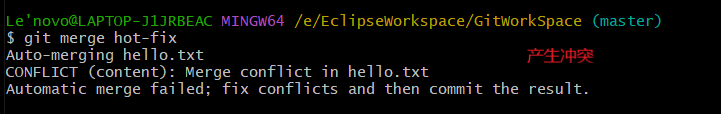
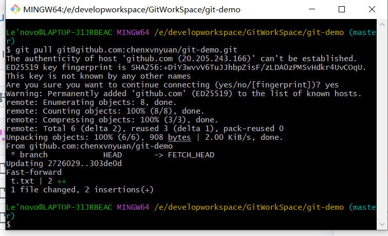

## 1.  Git介绍，安装和使用

Git官网：http://git-scm.com/


### 1.1 介绍

集中式版本控制工具：svn等等

分布式版本控制工具：git等等


工作机制

写好代码放在工作区，通过git add提交暂存区，最后通过git commit提交本地库，形成历史版本。

形成历史版本之后，如果出现错误，不能删除，只能基于这个错误版本进行修改，上传形成新的版本。


代码托管中心

远程仓库，简单来说就是远程库

基于局域网的远程库——gitlab

国外的代码托管中心——github

国内的代码托管中心——gitee


### 1.2 Git安装

版本：Git 2.36.1

只安装命令行模式


选择配置：安装了两个，未安装新特性


检查安装结果，右键打开git bash，输入git --version


### 1.3 Git的常用命令


设置用户签名和邮箱


初始化本地库：git init

穿越版本号：git reset --hard 版本号【底层是head指针的引用】

查看结果：cat hello.txt


### 1.4 git bash启动慢问题

解决办法：退出360或者电脑管家


### 1.5 分支的使用

常用命令


1/3：创建一个分支，切换到新分支，然后修改文件，提交暂存区和本地库，


2/3：切换回原来的master分支，查看被修改的文件，显示原来的，没有显示hot-fix修改的


3/3：将新分支合并到master中之后，重新查看文件，文件显示已经修改。


### 1.6 分支冲突

1/4：在**hot-fix 分支中修改hello.txt**文件，然后提交到暂存区，提交到本地库


2/4：切换到**master分支，同样修改hello.txt文件**，然后提交到暂存区，提交到本地库


3/4：然后合并hot-fix 分支，出现错误。




4/4：解决办法：打开文件，修改错误区域，然后将文件提交到暂存区，提交到本地库（不带文件名）


### 1.7 团队协作

团队内协作

前提是令狐冲和岳不群在一个团队里，即岳不群将令狐冲加入团队，赋予权限


跨团队协作


## 2.  Github的使用

### 2.1 我的github

Github网址：http://www.github.com/

git-demo仓库地址：https://github.com/chenxvnyuan/git-demo.git


### 2.2 网址创建别名

创建别名：git remote add git-demo https://github.com/chenxvnyuan/git-demo.git

查看别名：git remote -v


### 2.3 推送到远程库

git push git-demo master


需要建立连接（如下图），建立之后刷新页面，即可查看


### 2.4 拉取分支

git pull git-demo master

查看已经获得远程库的更新


### 2.5 克隆远程库

在文件夹中右键打开git bash 

克隆远程库：git clone https://github.com/chenxvnyuan/git-demo.git

克隆 =  拉取代码 + 初始化本地库 + 设置别名(别名和原库的别名不一致)


### 2.6 团队合作

团队内协作：

需要老员工将新人加入团队，加入之后，新人可以使用老员工发来的连接进入该团队，以后新人提交的代码在老员工的账号上也能看到相应的改变。


跨团队协作：

将远程仓库地址发送给团队外人员，团队外人员通过链接fork该仓库，将仓库下载到自己的代码中心，修改完成之后通过pull request将修改之后的代码库发回原地址，如果原仓库的管理员同意将该分支并入仓库则完成，如果有疑问可以通过交流窗口提交评论进行交流。


### 2.7 SSH免密登录

在本机用户主目录下生成.ssh文件：ssh-keygen -t rsa -C tom@qq.com

连续三次敲击回车键即可，最后会生成一个.ssh文件，进入该文件可以看到两个密钥。


将公钥复制，在远程库中添加ssh免密登录的密钥即可通过code方式中的ssh方式来进行代码的提交和拉取。


git测试

拉取测试：git pull git@github.com:chenxvnyuan/git-demo.git



提交测试：git push git@github.com:chenxvnyuan/git-demo.git master


至此，ssh测试成功。


## 3.  IDEA集成git

### 3.1 创建忽略文件

在本机用户主目录下，创建git.ignore文件

```txt
# 编译文件
*.class

# 日志文件
*.log

# BlueJ files
*.ctxt

# Mobile Tools for Java(J2ME)
.mtj.tmp/

# Package Files #
*.jar
*.war
*.nar
*.ear
*.zip
*.tar.gz
*.rar

# virtual machine crash logs, see http://www.java.com/en/download/help/error_hotspot.xml hs_err_pid*

.classpath
.project
.settings
target
.idea
*.xml
```


在.gitconfig文件中引用一下，例如：


### 3.2 在IDEA中设置版本控制

路径为git安装路径


项目中创建本地库


将项目添加暂存区，提交本地库


### 3.3 切换版本

IDEA左下角打开git，查看日志，选择版本进行切换


### 3.4 分支操作

3.4.1 创建分支，项目右键创建分支


3.4.2 切换分支


3.4.3 合并分支

如果产生合并冲突，就按照提示进行修改（懒得截图），结果如图。


## 4.  IDEA集成Github


### 4.1 IDEA设置GitHub账号

使用口令登录，在GitHub官网上进行设置，获得口令。


IDEA 设置口令，实现ssh免密登录


### 4.2 分享项目

等同于新建远程库 + 提交代码


### 4.3 推送代码 && 拉取代码

设置，push和pull的自定义别名


### 4.4 克隆代码

删除本地文件代码，从GitHub上克隆代码。


	

## 5.  IDEA集成gitee

### 5.1 设置和安装gitee插件

注：配置免密登录和GitHub一致，参考3.3。

安装，然后重启IDEA


配置登录账号


### 5.2 分享项目

和4.2一致


### 5.3 拉取和推送代码

和4.3一致

1/3 设置别名


2/3 推送代码


3/3 拉取


### 5.4 克隆代码

和4.4一致


### 5.5 GitHub项目迁移到gitee

gitee创建仓库选择导入已有仓库，选择GitHub项目的**https协议**，进行迁移

方式1：从URL导入（推荐）


方式2：绑定GitHub，从GitHub导入


GitHub上的项目上更新之后，在gitee上找到相应的项目，选择项目名后的更新按钮，进行GitHub同步更新。


## 6.  自定义GitLab

### 6.1 介绍


### 6.2 安装

1、 准备虚拟机

安装虚拟机:4G + 50G，并且设置虚拟机静态地址为192.168.0.222，设置主机名为Gitlab-server

```
# 打开终端，运行如下命令
# 设置静态地址
cd /etc/sysconfig/network-scripts
vim ifcfg-ens33

# 修改内容
将bootproto由dhcp改为static
添加以下内容：
IPADDR=192.168.0.222
NETMASK=255.255.255.0
GATEWAY=192.168.0.254
DNS1=114.114.114.114

# 重启网络和虚拟机
service network restart
reboot

# 修改主机名
vim /etc/hostname
```


配置本地yum源

```
# 设置挂载点
mkdir /media/cdrom
mount /dev/cdrom /media/cdrom

# 查看挂载点
df -h

# 备份默认源
cd /etc/
cp -rf /etc/yum.repos.d  /etc/yum.repos.d.bak

# 删除旧的源，添加新的本地源
rm -rf /etc/yum.repos.d/*
vim /etc/yum.repos.d/local.repo

# local.repo文件内容
[local]							  # yum标识，名称自定义
name=CentOS-$releasever - local		# 源名称，自定义
baseurl=file:///media/cdrom/	    # ios镜像挂载路径
gpgcheck=0						  # 不进行gpg key校验
enabled=1						  # 使用该yum仓库


# 清除yum缓存
yum clean all
# 缓存本地yum源
yum makecache
# 测试本地源
yum list
```


2、修改Windows映射

打开本机hosts文件（地址：C:\Windows\System32\drivers\etc），配置windows映射地址


3、下载gitlab文件

下载地址：https://packages.gitlab.com/gitlab/gitlab-ce/

选择版本：gitlab-ce-15.1.0-ce.0.amazon2.x86_64.rpm


4、 上传到虚拟机


5、安装

```
# 查看防火墙状态
systemctl status firewalld

# 开放222端口
firewall-cmd --zone=public --add-port=222/tcp --permanent
firewall-cmd --reload
systemctl status firewalld
systemctl stop firewalld
systemctl start firewalld


# 暂时关闭防火墙
systemctl stop firewalld

# 编写安装脚本
vim gitlab-install.sh

# 脚本内容
# /root/下载/gitlab-ce-15.1.0-ce.0.amazon2.x86_64.rpm是文件地址目录
sudo rpm -ivh /root/下载/gitlab-ce-15.1.0-ce.0.amazon2.x86_64.rpm
sudo yum install -y curl policycoreutils-python openssh-server cronie
yum install lokkit
sudo lokkit -s http -s ssh
sudo yum install -y postfix
sudo service postfix start
sudo chkconfig postfix on

# curl https://packages.gitlab.com/install/repositories/gitlab/gitlab-ce/script.rpm.sh | sudo bash

# 下载gitlab，
wget https://mirrors.tuna.tsinghua.edu.cn/gitlab-ce/yum/el7/gitlab-ce-15.1.0-ce.0.el7.x86_64.rpm
rpm -i gitlab-ce-15.1.0-ce.0.el7.x86_64.rpm


# 添加GitLab包存储库并且安装软件包
# curl https://packages.gitlab.com/install/repositories/gitlab/gitlab-ce/script.rpm.sh | sudo bash
# sudo EXTERNAL_URL="http://gitlab.example.com" yum -y install gitlab-ce

# 给文件添加权限
chmod +x gitlab-install.sh

# 安装
./gitlab-install.sh

# 初始化
gitlab-ctl reconfigure

# 启动
gitlab-ctl start

# 设置开机自动启动
？？？
```


6、浏览器访问：gitlab-server

设置初始密码和确认密码，即可正常使用


### 6.3 使用

创建远程库和gitee以及GitHub一致


### 6.4 IDEA集成gitlab

IDEA安装gitlab插件

配置gitlab，定义远程连接，其他操作和集成GitHub，gitee一致


