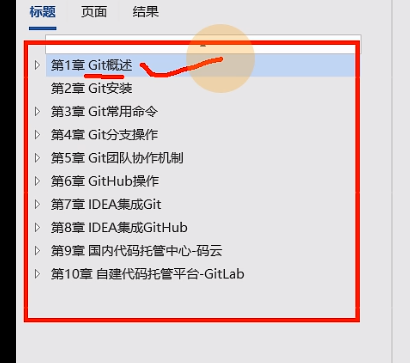

## 写在前面

## 2020年6月25日——第一天

1、Git介绍，安装和使用

2、Gihub的使用，将代码推送到远程库和从远程库拉取代码。

## 2020年6月26日——第二天

1、Github团队协作和ssh免密登录

2、IDEA集成Git、Github、Gitee

3、自定义Gitlab(部分)

遗留问题，未安装成功gitlab，需要配置yum源，然后浏览器测试，完成IDEAj集成Gitlab

